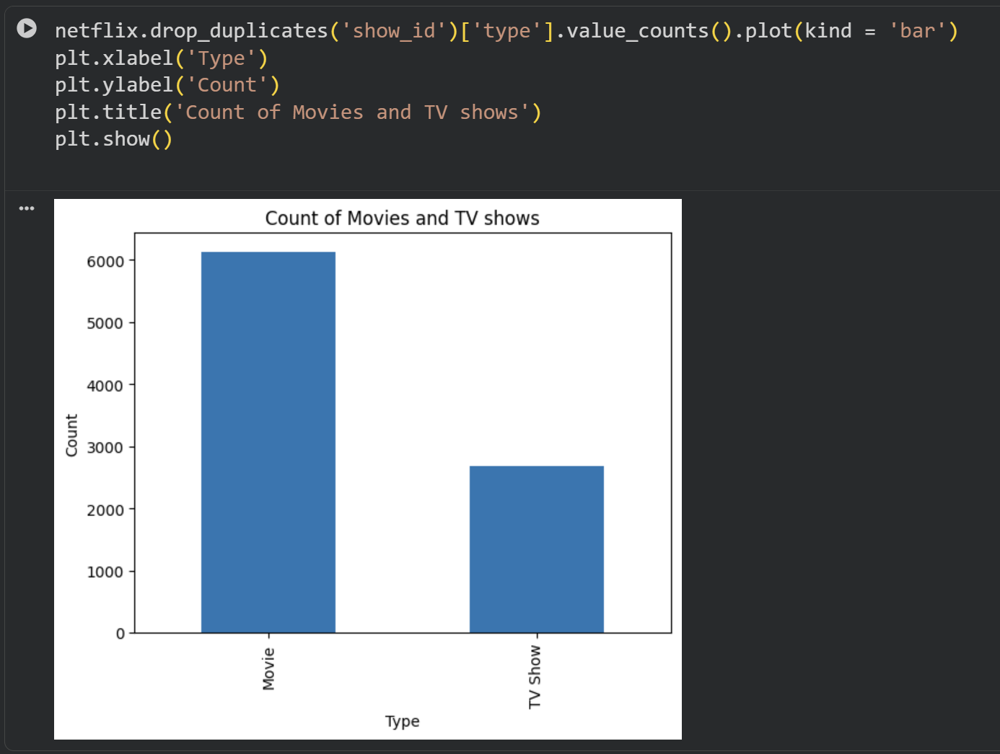
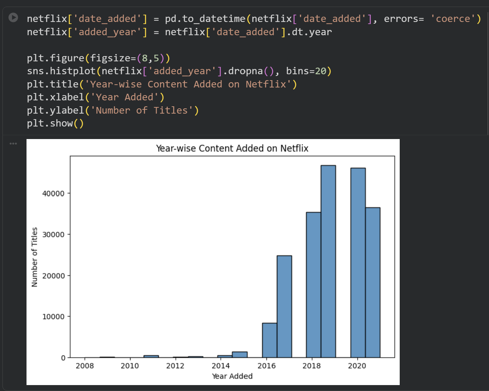
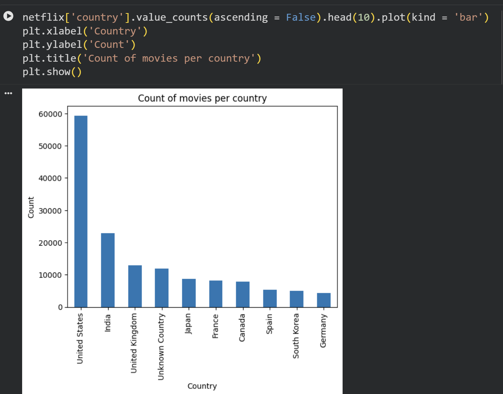
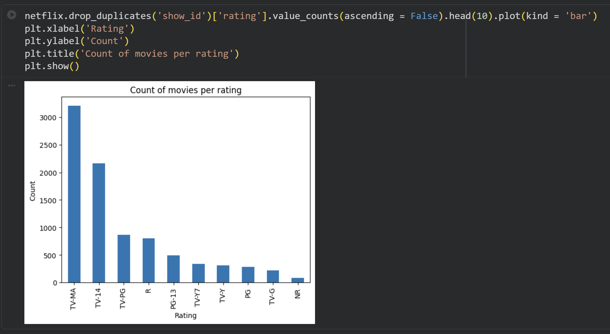
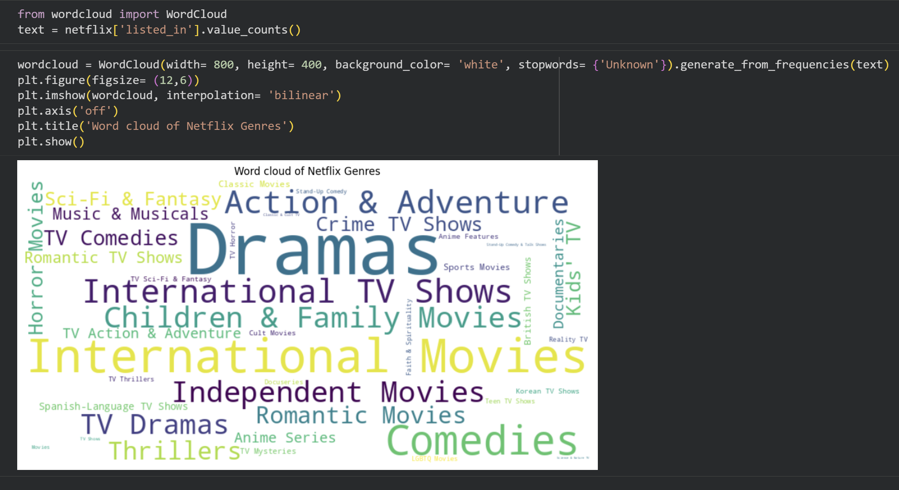
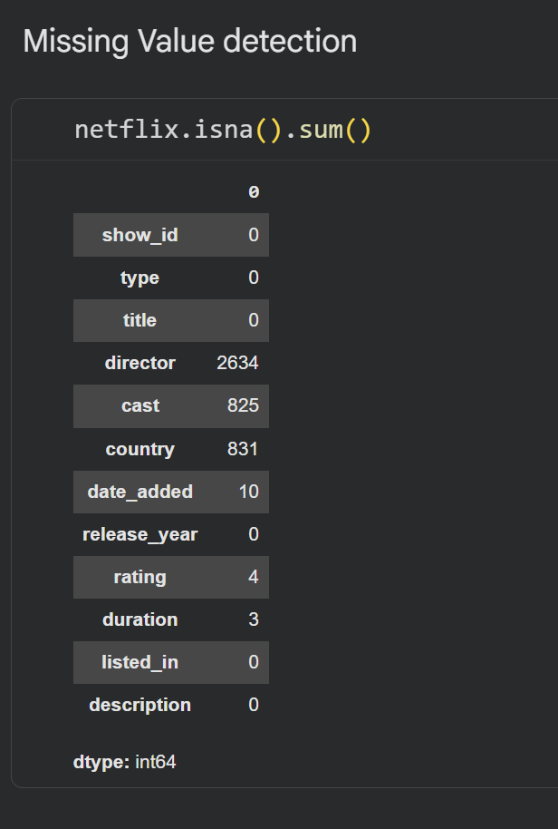

# Netflix Content & Market Trend Analysis

## Overview

This project analyzes Netflix's content catalog using Python to uncover content distribution patterns, release trends, country-wise production insights, genre preferences, audience rating distributions, and content addition behavior. The analysis was performed using exploratory data analysis (EDA), data cleaning, and visualization techniques to generate business-relevant insights and recommendations.

## Tools & Technologies

- Python
- Pandas
- NumPy
- Matplotlib
- Seaborn
- Google Colab

## Dataset

The Netflix Titles Dataset contains information on 8,807 titles available on Netflix, including:

- Movies and TV Shows
- Release Year
- Country
- Director
- Cast
- Rating
- Duration
- Genre Categories

## Project Objectives

- Analyze content distribution between Movies and TV Shows.
- Identify content growth trends over time.
- Explore country-wise content production patterns.
- Study audience rating distributions.
- Analyze genre popularity.
- Perform data cleaning and missing value treatment.
- Generate business insights and recommendations.

---

## Analysis 1: Content Type Distribution

### Business Question

What is the distribution of Movies and TV Shows on Netflix?



### Key Insight

- Movies account for the majority of Netflix's content library.
- TV Shows form a smaller but steadily growing segment.

---

## Analysis 2: Content Release Trend

### Business Question

How has Netflix's content library evolved over time?



### Key Insight

- Content additions increased rapidly after 2016.
- Netflix significantly expanded its catalog during recent years.

---

## Analysis 3: Country-wise Content Production

### Business Question

Which countries contribute the most content to Netflix?



### Key Insight

- The United States contributes the highest number of titles.
- India is the second-largest contributor to Netflix's content library.

---

## Analysis 4: Rating Distribution

### Business Question

What are the most common audience ratings on Netflix?



### Key Insight

- TV-MA and TV-14 are the most common ratings.
- Netflix primarily serves mature and young-adult audiences.

---

## Analysis 5: Genre Analysis

### Business Question

Which genres are most popular on Netflix?



### Key Insight

- Drama is the most frequently occurring genre on Netflix.
- Strong audience demand exists for drama-based content.

---

## Analysis 6: Missing Value Analysis

### Business Question

Which columns contained missing values and how were they handled?



### Key Insight

- Missing values were identified in columns such as Director, Cast, Country, Date Added, and Rating.
- Appropriate preprocessing techniques were applied to improve data quality and analysis accuracy.

---

## Business Insights

### Movies Dominate the Netflix Content Library
- Movies are nearly three times more prevalent than TV Shows on Netflix.
- This indicates that Netflix's content strategy has historically focused more on movies than episodic content.

### Drama is the Most Popular Genre
- Word cloud analysis revealed that Drama is the most frequently occurring genre on Netflix.
- This suggests a strong and consistent audience demand for drama-based content.

### United States Leads Content Production
- The United States contributes the highest number of titles available on Netflix, followed by India.
- These countries represent key content production and consumption markets for the platform.

### Netflix Content Addition Increased Significantly After 2016
- Analysis of content additions over time shows rapid growth after 2016.
- This reflects Netflix's aggressive expansion strategy and increased investment in content acquisition and production.

### TV Shows are More Recent than Movies
- Boxplot analysis indicates that TV Shows generally have more recent release years compared to Movies.
- This suggests increased investment in newer television content.

### Most Movies Follow Standard Duration
- Histogram analysis shows that the majority of movies have durations between 80 and 120 minutes.
- This represents the preferred movie length across the platform.

### January and July are Key Content Release Periods
- Analysis of content addition by month and week shows that January and July have the highest number of title additions.
- These periods appear to be preferred windows for content launches.

### Movies are Typically Added Within One Year of Release
- The mode of the difference between release year and content addition date is approximately 334 days.
- This indicates that many movies are added to Netflix within a year of their original release.

---

## Recommendations

### Increase Investment in Drama Content
- Since Drama consistently appears as the most prominent genre, Netflix should continue investing in and acquiring high-quality drama content to satisfy audience demand.

### Strengthen Content Production in Key Markets
- Netflix should expand content production initiatives in the United States and India, as these countries contribute significantly to the platform's content library.

### Produce More New TV Show Content
- Given the trend toward newer TV Shows, Netflix should invest further in fresh television content, including limited series and original productions.

### Plan Major Releases During Peak Months
- Netflix should prioritize major content launches during January and July to maximize visibility, engagement, and audience reach.

### Improve Metadata Quality
- Missing information in fields such as Cast, Director, Date Added, and Rating should be reduced to improve search accuracy, recommendation quality, and overall user experience.

### Focus on Standard-Length Movies
- Since most successful titles fall within the 80–120 minute range, Netflix should continue producing and acquiring movies within this preferred duration band.

### Invest in TV-MA Content
- Analysis indicates strong audience preference for TV-MA rated content.
- Netflix should continue expanding its portfolio of mature-audience programming while maintaining content diversity.

---

## Skills Demonstrated

- Data Cleaning
- Exploratory Data Analysis (EDA)
- Data Visualization
- Pandas Data Manipulation
- Missing Value Treatment
- Trend Analysis
- Business Insight Generation
- Business Recommendations
- Python Programming
- Statistical Exploration

---

## Repository Structure

```text
netflix-content-analysis
│
├── README.md
├── notebooks
│   └── Netflix_Content_Analysis.ipynb
├── reports
│   └── Netflix Business Case.pdf
├── screenshots
│   ├── content_distribution.png
│   ├── release_trend.png
│   ├── country_analysis.png
│   ├── ratings_analysis.png
│   ├── genre_analysis.png
│   └── missing_value_analysis.png
└── requirements.txt
```

---

## Author

**Prabhakar Ramkumar**

Data Analyst | SQL | Python | Tableau | EDA | Data Visualization
